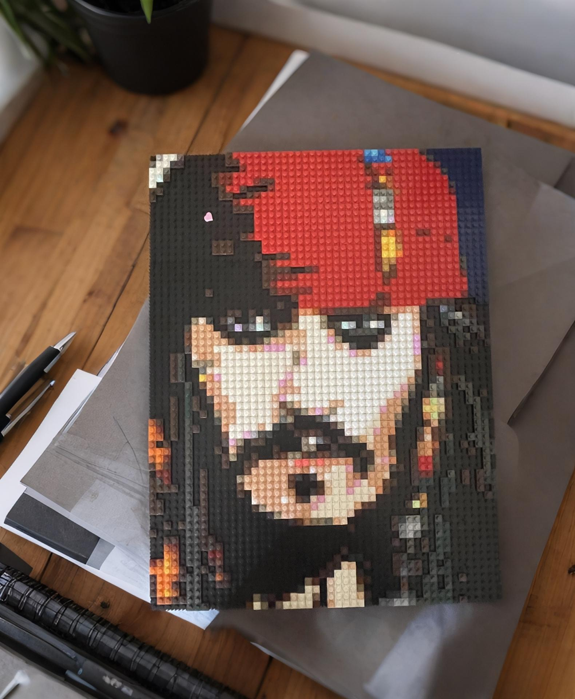

# ai-plugs


[](LICENSE)
[](https://www.python.org/)

[//]: # ([![Build Status]&#40;https://img.shields.io/travis/user/repo/master.svg&#41;]&#40;https://travis-ci.org/user/repo&#41;)

## 工作室公众号


### 会陆续开源更多优质资源，可以先关注下，
### 后续开源内容将在公众号发布


## 介绍

#### 模型不大， 可以用 onnxruntime 很好的在服务器运行

#### 这是一个用于检测图像中非安全内容（NSFW）的 Python 库。该库利用 ONNX 模型对图像进行预处理和分类，并提供了多种方法来评估图像的风险等级。

### python 版本我用的3.13没有问题，3.8以下可能不太行，没试


## 快速开始
### 导入库


```bash
pip install -r requirements.txt
```


# 使用模型推理
```bash

# 使用自定义模型
nsfw_custom = setup_nsfw(os.path.join(settings_aiplugs.MODELS_DIR, 'you_new_.onnx'))

# 使用默认模型[使用默认模型即可，很精准]
nsfw = setup_nsfw() 

# 测试图片路径 【支持base64】
image = '/path/to/image.jpg'

# 返回归一化的结果[0-1之间]float, 越接近1就越少儿不宜
result_ndh = nsfw.nsfw_risk_ndh(image)
print(f"result image: {result_ndh}")

# 返回 True 或者 False T就是少儿不宜
result_tf = nsfw.nsfw_risk_tf(image)
print(f"result image: {result_tf}")


```


## 解释

nsfw_risk_tf: 返回一个布尔值，表示图像是否被认为是 NSFW（非安全内容）。
nsfw_risk_ndh: 返回一个概率值，表示图像被认为是 NSFW 的概率。


## 参数说明
nsfw_risk_ndh 方法
input_image: 输入图像的路径、Base64 编码字符串或 PIL.Image.Image 对象。
threshold: 阈值，默认为 0.8，用于判断图像是否被认为是 NSFW。

nsfw_risk_tf 方法
input_image: 输入图像的路径、Base64 编码字符串或 PIL.Image.Image 对象。


## 示例代码

```bash
from nsfw.nsfw_service import setup_nsfw

classifier = setup_nsfw()  # 使用默认模型路径

# 测试图片路径
image = '/path/to/image.jpg'

result = classifier.nsfw_risk_ndh(image)
result2 = classifier.nsfw_risk_tf(image)
print(f"result image: {result}")
print(f"result image2: {result2}")
print("-" * 40)


```


许可证
此项目采用 MIT 许可证。详情参见 LICENSE 文件。

如有任何问题或建议，
请联系：
### 作者: 李权威

### 邮箱: cnlqws@gmail.com


## 其他玩具项目

### 小程序 录入个人信息，对方扫码就能保存你的联系方式
### 【无需网络，不上传任何个人信息，请放心使用】


### 免费制作证件照的 AI 裁剪换背景


### 织图AI 小程序，做积木画、礼物、手工定制的


### 实物效果类似这样的，喜欢的可以去  织图AI 小程序里看看





# Lincese

This repository is licensed under the [LINCESE](LINCESE)


## 📚 引用
如果您在研究或项目中使用了 ai_plugs，请考虑引用我们的工作。您可以使用以下BibTeX条目：

@misc{li2024aiplugs,
  author       = {李权威},
  title        = {{ai_plugs}: 人工智能工具集合},
  month        = oct,
  year         = 2024,
  howpublished = {\url{https://github.com/JingYuTech/nsfw}},
  note         = {Accessed: 2024-10-23}
}


 
