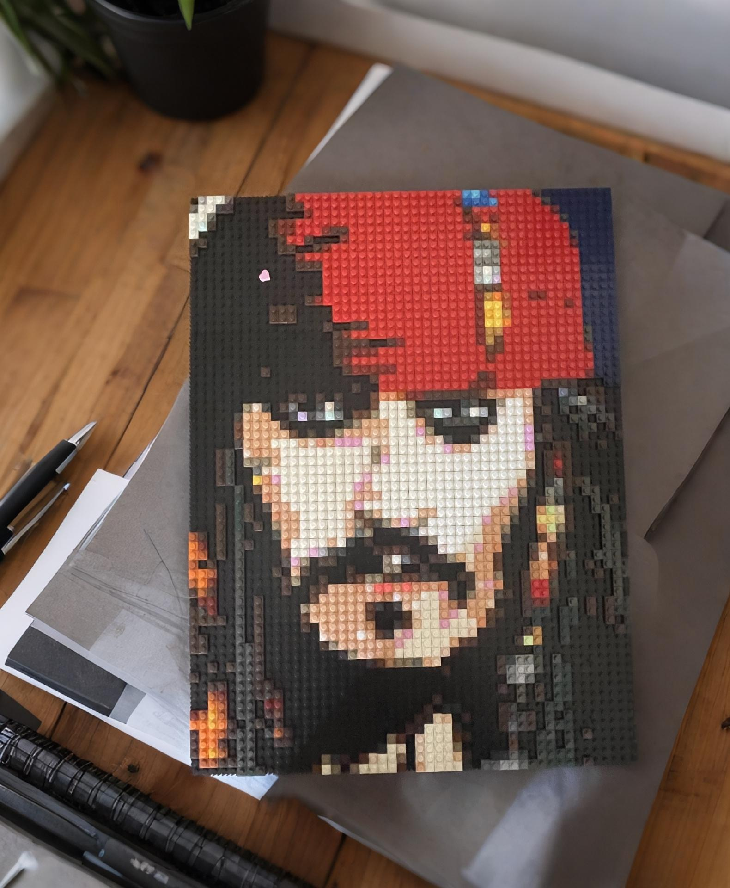

# ai-plugs


[](LICENSE)
[](https://www.python.org/)


Studio WeChat Official Account


### More high-quality resources will be open-sourced soon. You can follow us first.
### Subsequent open-source content will be published through the official account.

## Introduction
#### The model is lightweight and runs well using ONNX Runtime on servers.
#### This is a Python library for detecting non-safe-for-work (NSFW) content in images. The library utilizes an ONNX model for image preprocessing and classification, and provides various methods to assess the risk level of images.
#### Python Version: I tested with Python 3.13 and it works fine, but it may not work with versions below 3.8, which I haven't tried yet.

## Quick Start
### Install Dependencies
```bash
pip install -r requirements.txt
```


# Using Model Inference
```bash

# Using a custom model
nsfw_custom = setup_nsfw(os.path.join(settings_aiplugs.MODELS_DIR, 'you_new_.onnx'))

# Using the default model [The default model is highly accurate]
nsfw = setup_nsfw() 

# Test image path [Supports base64 encoding]
image = '/path/to/image.jpg'

# Returns a normalized score [between 0 and 1], closer to 1 indicates more NSFW
result_ndh = nsfw.nsfw_risk_ndh(image)
print(f"Result for image: {result_ndh}")

# Returns True or False, True indicates NSFW
result_tf = nsfw.nsfw_risk_tf(image)
print(f"Result for image: {result_tf}")
```


## Explanation
nsfw_risk_tf: Returns a boolean value indicating whether the image is considered NSFW (non-safe-for-work).
nsfw_risk_ndh: Returns a probability score indicating the likelihood that the image is NSFW.

## Parameters
nsfw_risk_ndh method

input_image: Path to the input image, a base64-encoded string, or a PIL.Image.Image object.
threshold: Threshold, default is 0.8, used to determine if the image is considered NSFW.
nsfw_risk_tf method

input_image: Path to the input image, a base64-encoded string, or a PIL.Image.Image object.

## Example Code
```bash
from nsfw.nsfw_service import setup_nsfw

classifier = setup_nsfw()  # Use the default model path

# Test image path
image = '/path/to/image.jpg'

result = classifier.nsfw_risk_ndh(image)
result2 = classifier.nsfw_risk_tf(image)
print(f"Result for image: {result}")
print(f"Result for image2: {result2}")
print("-" * 40)

```

许可证
此项目采用 MIT 许可证。详情参见 LICENSE 文件。

如有任何问题或建议，
请联系：

### Author: Li Quanwei
### Email: cnlqws@gmail.com


### Other Toy Projects
Mini Program to Enter Personal Information and Save Contact Details via QR Code
[No internet required, no personal information uploaded, please feel free to use]


### Free AI Portrait Cropping and Background Change


### ZhiTu AI Mini Program for Customized Mosaic Art and Gifts


### Example Output Similar to This, Check Out the ZhiTu AI Mini Program for More


# License
This repository is licensed under the LINCESE

## 📚 Citation
If you use ai_plugs in your research or projects, please consider citing our work. You can use the following BibTeX entry:

@misc{li2024aiplugs,
author       = {Li Quanwei},
title        = {{ai_plugs}: Artificial Intelligence Tools Collection},
month        = oct,
year         = 2024,
howpublished = {\url{https://github.com/JingYuTech/nsfw}},
note         = {Accessed: 2024-10-23}
}